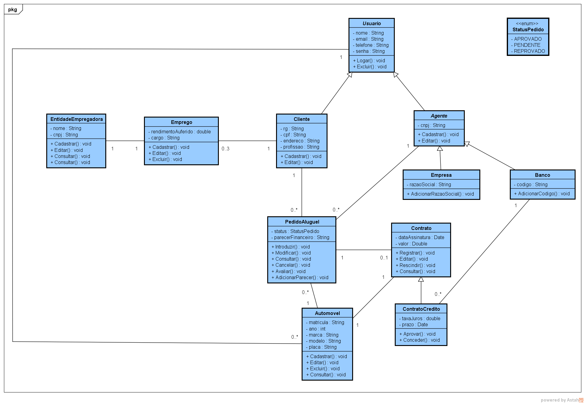
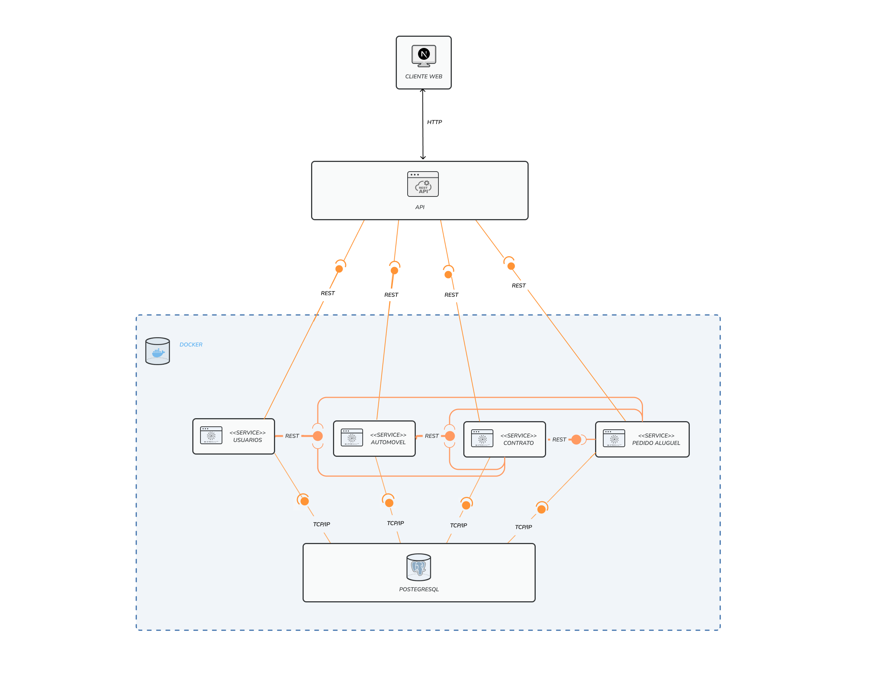
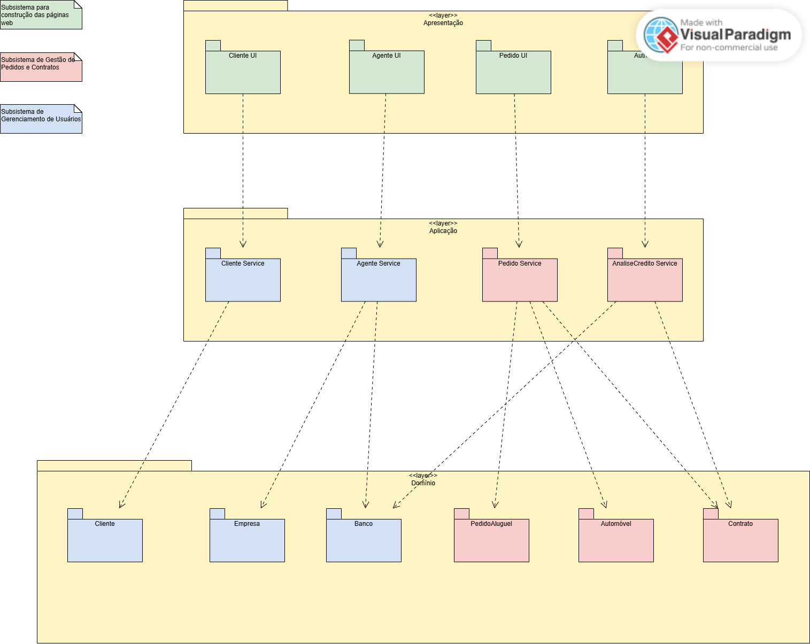
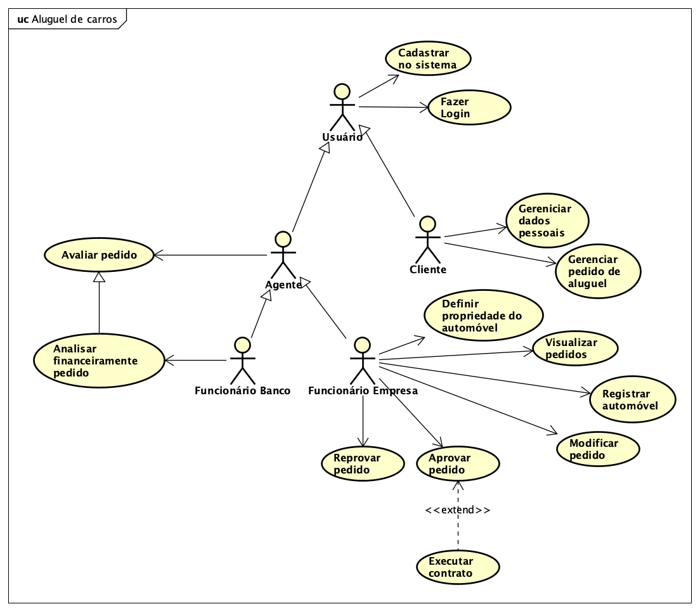
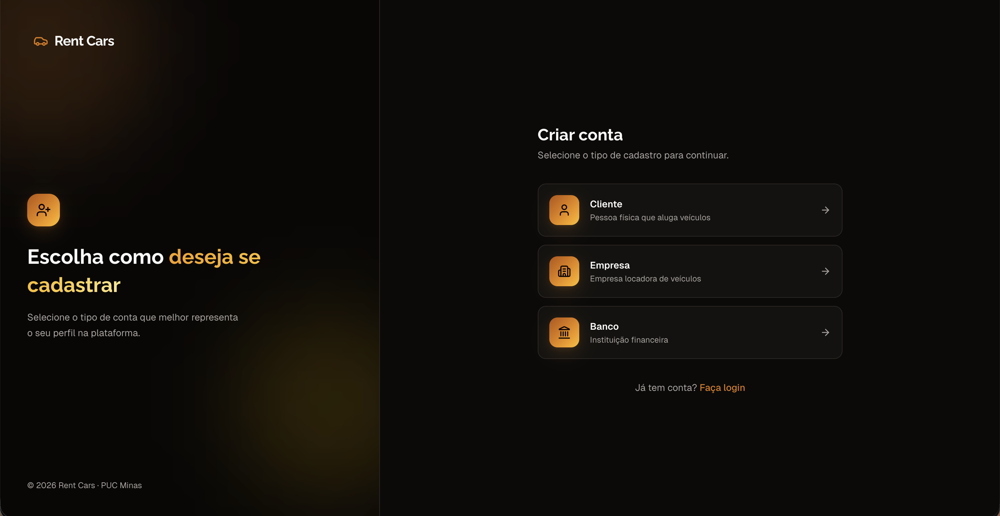
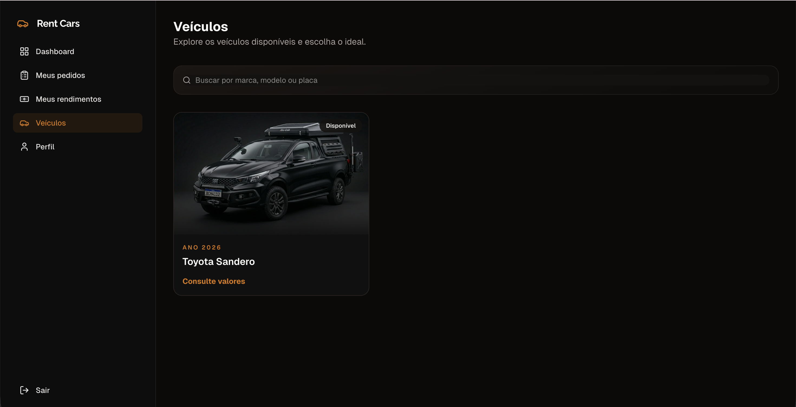
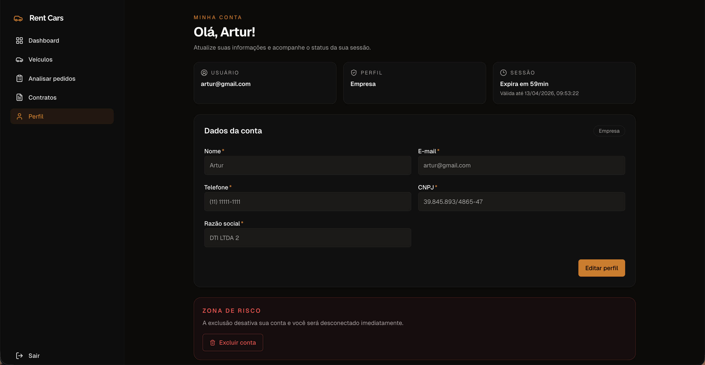
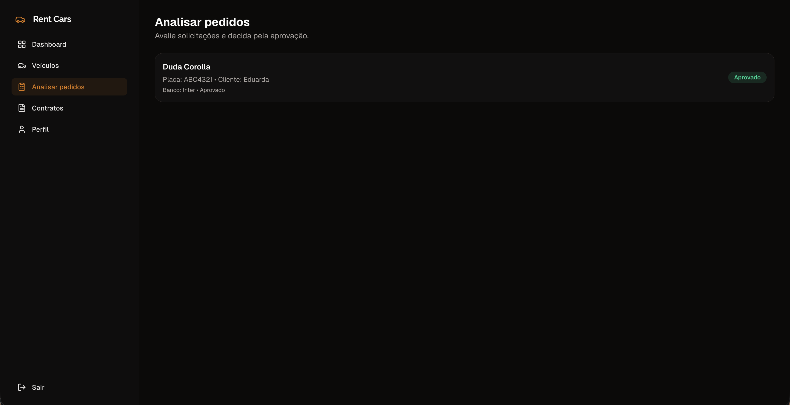
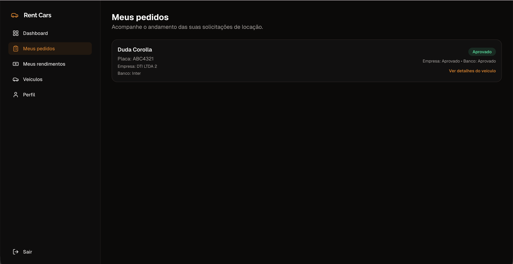
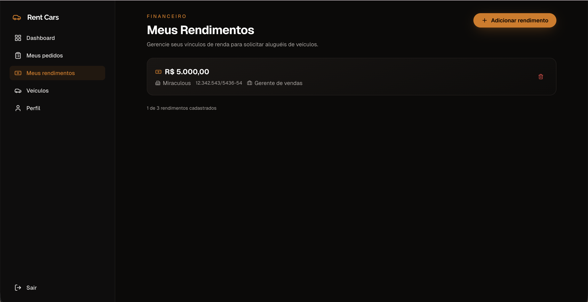

# 🚗 Rent Cars - Aluguel de carros

O Rent Cars é um sistema web voltado à gestão de aluguel de automóveis, desenvolvido por estudantes de Engenharia de Software da PUC Minas — Artur Bomtempo Colen, Eduarda Vieira Gonçalves e Vitor Azevedo — como projeto acadêmico sob orientação do Prof. Dr. João Paulo Aramuni.

A aplicação permite que empresas e clientes cadastrem, consultem e gerenciem veículos, clientes, contratos e pedidos de aluguel de forma centralizada e organizada, contribuindo para maior eficiência no controle das operações.

Seu desenvolvimento tem como objetivo aplicar, na prática, conceitos fundamentais da Engenharia de Software, como arquitetura MVC, modelagem UML e boas práticas de desenvolvimento. Além disso, o projeto proporciona experiência com tecnologias modernas, documentação técnica e trabalho colaborativo em equipe.

---

## 🚧 Status do Projeto e Tecnologias


---

## 📚 Índice

- [Sobre o Projeto](#-sobre-o-projeto)
- [Funcionalidades Principais](#-funcionalidades-principais)
- [Tecnologias Utilizadas](#-tecnologias-utilizadas)
- [Arquitetura](#-arquitetura)
  - [Exemplos de diagramas](#exemplos-de-diagramas)
- [Instalação e Execução](#-instalação-e-execução)
  - [Pré-requisitos](#pré-requisitos)
  - [Variáveis de Ambiente](#-variáveis-de-ambiente)
  - [Preparação do Projeto](#-preparação-do-projeto)
  - [Banco de Dados](#-banco-de-dados)
  - [Como Executar a Aplicação](#-como-executar-a-aplicação)
- [Deploy](#-deploy)
- [Estrutura de Pastas](#-estrutura-de-pastas)
- [Demonstração](#-demonstração)
  - [Aplicativo Mobile](#-aplicativo-mobile)
  - [Aplicação Web](#-aplicação-web)
  - [Exemplo de saída no Terminal (para Back-end, API, CLI)](#-exemplo-de-saída-no-terminal-para-back-end-api-cli)
- [Endpoints da API](#-endpoints-da-api)
- [Testes](#-testes)
- [Documentações utilizadas](#-documentações-utilizadas)
- [Autores](#-autores)
- [Contribuição](#-contribuição)
- [Agradecimentos](#-agradecimentos)
- [Licença](#-licença)

---

## 📝 Sobre o Projeto

O Rent Cars foi criado para centralizar e simplificar o processo de aluguel de veículos em um único sistema, conectando perfis como cliente, empresa, banco e agente em fluxos de cadastro, análise e gestão de pedidos.

No contexto acadêmico da Engenharia de Software (PUC Minas), o projeto aplica na prática conceitos de modelagem UML, arquitetura em camadas, APIs REST, autenticação com JWT e persistência relacional.

O sistema resolve problemas comuns de operação manual e descentralizada, como:

- dificuldade de rastrear pedidos e contratos;
- inconsistência no cadastro de usuários e veículos;
- falta de visão unificada para análise e aprovação de solicitações.

Com isso, o projeto entrega uma base funcional e evolutiva para gestão de locação de carros, com separação clara entre front-end, back-end e banco de dados, facilitando manutenção, testes e evolução incremental.

---

## ✨ Funcionalidades Principais

- 🔐 **Autenticação Segura:** Login, Cadastro e Recuperação de Senha.
- 📈 **Painel de Controle:** Visualização de dados em tempo real com gráficos.
- ⚙️ **Gerenciamento de CRUD:** Criação, Leitura, Atualização e Deleção de recursos (e.g., Usuários, Itens, Posts).
- 📊 **Relatórios Exportáveis:** Exportação de dados em PDF, CSV ou Excel.
- 🌐 **Internacionalização (i18n):** Suporte a múltiplos idiomas.
- 🧵 **Logs e Monitoramento:** Registro detalhado de atividades e análise de desempenho.
- 🔄 **Integração com APIs Externas:** Conexão com serviços de terceiros (pagamentos, mapas, autenticação, etc.).
- 📨 **Sistema de Notificações:** Envio de alertas por e-mail, push ou notificações internas.

---

## 🛠 Tecnologias Utilizadas

As seguintes ferramentas, frameworks e bibliotecas foram utilizados na construção deste projeto. Recomenda-se o uso das versões listadas (ou superiores) para garantir a compatibilidade.

### 💻 Front-end

- **Framework:** Next.js
- **Linguagem:** TypeScript
- **Estilização:** Tailwind CSS
- **Biblioteca UI:** shadcn/ui
- **Hospedagem:** Vercel

### 🖥️ Back-end

- **Linguagem:** Java 21
- **Framework:** Micronaut
- **Banco de Dados:** PostgreSQL
- **ORM:** Micronaut Data + Hibernate JPA
- **Autenticação:** JWT
- **Upload de Imagens:** Cloudinary
- **Hospedagem:** Render

### ⚙️ Infraestrutura & DevOps

- **Containerização:** Docker
- **Orquestração Local:** Docker Compose
- **Deploy em Nuvem:** Vercel (client) e Render (server)
- **Banco em Desenvolvimento:** PostgreSQL 16 em container Docker

---

## 🏗 Arquitetura

O projeto adota uma arquitetura em camadas, no formato de monólito modular, com responsabilidades bem separadas entre interface, regras de negócio e persistência.

### Arquitetura em camadas

1. Camada de Apresentação (Front-end)
- Aplicação Next.js com TypeScript.
- Responsável pelas telas públicas e privadas, autenticação no cliente e consumo da API.

2. Camada de Interface HTTP (Controllers)
- Implementada no back-end Micronaut em `server/src/main/java/br/pucminas/controller`.
- Expõe endpoints REST para autenticação, usuários, veículos, pedidos e vínculos.

3. Camada de Aplicação/Negócio (Services)
- Implementada em `server/src/main/java/br/pucminas/service`.
- Centraliza regras de negócio, validações e orquestração dos fluxos do sistema.

4. Camada de Acesso a Dados (Repositories)
- Implementada em `server/src/main/java/br/pucminas/repository` com Micronaut Data + Hibernate.
- Encapsula consultas e persistência das entidades.

5. Camada de Domínio e Contratos
- Entidades JPA em `server/src/main/java/br/pucminas/model`.
- DTOs de entrada e saída em `server/src/main/java/br/pucminas/dto`.
- Exceções e tratamento de erro em `server/src/main/java/br/pucminas/exception`.

6. Camada de Segurança
- Implementada em `server/src/main/java/br/pucminas/security`.
- Realiza autenticação/autorização com JWT (quando `SECURITY_ENABLED=true`).

### Banco de dados e infraestrutura

- O sistema utiliza um único banco de dados PostgreSQL (16), executado em container Docker.
- O banco é orquestrado via Docker Compose pelo serviço `db`.
- A persistência local é mantida no volume nomeado `rentcars-db-data`.

### Fluxo resumido

1. O usuário interage com a interface web (Next.js).
2. A interface envia requisições para a API Micronaut.
3. O controller encaminha a operação para a camada de serviço.
4. O serviço aplica regras de negócio e utiliza repositórios.
5. O repositório persiste/consulta dados no PostgreSQL.
6. A resposta retorna ao front-end em formato de DTO.

Essa organização facilita manutenção, testes e evolução do projeto, reduzindo acoplamento entre interface, regras de negócio e persistência.

### Exemplos de diagramas

Os diagramas abaixo refletem os artefatos atuais do projeto.

### Diagrama de Classes



### Diagrama de Componentes



### Diagrama de Implantacao


### Diagrama de Pacotes



### Diagrama de Caso de Uso



---

## 🔧 Instalação e Execução

### Pré-requisitos

Certifique-se de que o usuário tenha o ambiente configurado:

- **Docker** (Necessário) — [Instale o Docker Desktop](https://www.docker.com/products/docker-desktop)
- **Docker Compose** (Incluído no Docker Desktop) — Para orquestração de múltiplos serviços
- **Git** (Opcional) — Para clonar o repositório

---

### 🔑 Variáveis de Ambiente

Crie um arquivo **`.env`** na raiz do projeto (mesmo nível do `docker-compose.yml`) com as configurações necessárias para o banco de dados e aplicação.

#### Back-end (Micronaut + PostgreSQL)

O arquivo `.env` precisa conter as seguintes variáveis:

| Variável                         | Descrição                                        | Exemplo                  | Padrão        |
| :------------------------------- | :----------------------------------------------- | :----------------------- | :------------ |
| `DB_NAME`                        | Nome do banco de dados PostgreSQL.               | `rentcars`               | `rentcars`    |
| `DB_USER`                        | Usuário do banco de dados.                       | `postgres`               | `postgres`    |
| `DB_PASSWORD`                    | Senha do banco de dados.                         | `postgres123`            | `postgres`    |
| `DB_PORT_HOST`                   | Porta exposta do PostgreSQL na máquina host.     | `5432`                   | `5432`        |
| `APP_PORT`                       | Porta onde a aplicação Micronaut será executada. | `8080`                   | `8080`        |
| `SECURITY_ENABLED`               | Ativar/desativar segurança JWT.                  | `false` ou `true`        | `true`       |
| `JWT_GENERATOR_SIGNATURE_SECRET` | Chave secreta para assinatura de tokens JWT.     | `sua_chave_secreta_aqui` | (Obrigatório) |
| `CLOUDINARY_CLOUD_NAME`          | Nome da cloud no Cloudinary (upload de imagens). | `my_cloud`               | (Obrigatório) |
| `CLOUDINARY_API_KEY`             | Chave de API do Cloudinary.                      | `123456789012345`        | (Obrigatório) |
| `CLOUDINARY_API_SECRET`          | Segredo de API do Cloudinary.                    | `abcdefghijk`            | (Obrigatório) |

#### Front-end (Next.js)

No front-end, crie um arquivo `.env.local` dentro da pasta `client/` com a variável abaixo:

| Variável              | Descrição                                  | Exemplo                 |
| :-------------------- | :----------------------------------------- | :---------------------- |
| `NEXT_PUBLIC_API_URL` | URL base da API consumida pelo front-end.  | `http://localhost:8080` |

**Exemplo de `client/.env.local`:**

```bash
NEXT_PUBLIC_API_URL=http://localhost:8080
```

**Exemplo de arquivo `.env`:**

```bash
# Database Configuration
DB_NAME=rentcars
DB_USER=postgres
DB_PASSWORD=postgres123
DB_PORT_HOST=5432

# Application Configuration
APP_PORT=8080

# Security Configuration
SECURITY_ENABLED=true
JWT_GENERATOR_SIGNATURE_SECRET=my-secret-key-change-in-production

# Cloudinary Configuration (upload de imagens)
CLOUDINARY_CLOUD_NAME=your_cloud_name
CLOUDINARY_API_KEY=your_api_key
CLOUDINARY_API_SECRET=your_api_secret
```

> ⚠️ **Segurança:** Altere a senha do banco de dados e a chave JWT em **produção**. Nunca cometa o arquivo `.env` com valores reais em um repositório público.

### 📦 Preparação do Projeto

Clone o repositório e configure o arquivo de variáveis de ambiente.

1.  **Clone o Repositório:**

```bash
git clone https://github.com/eduardavieira-dev/rent-cars.git
cd rent-cars
```

2.  **Crie o arquivo `.env`:**

Na raiz do projeto (mesmo nível do `docker-compose.yml`), crie um arquivo `.env` com as variáveis listadas na seção anterior.

```bash
# Exemplo:
DB_NAME=rentcars
DB_USER=postgres
DB_PASSWORD=postgres123
DB_PORT_HOST=5432
APP_PORT=8080
SECURITY_ENABLED=true
JWT_GENERATOR_SIGNATURE_SECRET=minha-chave-secreta
CLOUDINARY_CLOUD_NAME=your_cloud_name
CLOUDINARY_API_KEY=your_api_key
CLOUDINARY_API_SECRET=your_api_secret
```

> 💡 **Dica:** Se o arquivo `.env` já existir no repositório, verifique se os valores estão corretos para seu ambiente.

---

### 💾 Banco de Dados (PostgreSQL)

O projeto utiliza **um único banco PostgreSQL 16**, inicializado e gerenciado via **Docker Compose** (serviço `db`).

O volume `rentcars-db-data` mantém os dados entre reinicializações dos containers. Em caso de reset completo do banco, use `docker compose down -v`.

**Schema do Banco:**
O Micronaut gerencia o schema automaticamente via **Hibernate** (`hbm2ddl.auto=update`), criando e atualizando as tabelas conforme necessário no startup da aplicação.

> ✅ **Nenhuma ação manual de migração é necessária** — o banco será criado automaticamente quando você rodar `docker-compose up`.

---

### ⚡ Como Executar a Aplicação

A aplicação roda completamente em Docker Compose com a API Micronaut e o banco de dados PostgreSQL.

#### 🐳 Docker Compose (Recomendado)

Esta é a forma mais simples e recomendada para rodar a aplicação completa localmente.

1. **Acesse a raiz do projeto:**

```bash
cd /Users/artur/Desktop/rent-cars
```

2. **Suba app + banco:**

```bash
docker-compose up -d --build
```

> 💡 O parâmetro `--build` reconstrói as imagens Docker com o código mais recente, e `-d` executa em segundo plano.

3. **Verifique se os containers estão rodando:**

```bash
docker-compose ps
```

Você deve ver:

- `rentcars-db` (PostgreSQL) com status `Healthy`
- `rentcars-app` (Micronaut API) com status `Running`

4. **Visualize os logs da aplicação:**

```bash
# Ver logs em tempo real
docker-compose logs -f app

# Ver apenas os últimos logs
docker-compose logs app
```

🚀 \*A API estará disponível em **http://localhost:8080\***

---

#### 📝 Testes Rápidos com cURL

Com a aplicação rodando, você pode verificar rapidamente o funcionamento básico.
Para a lista completa de todos os endpoints com exemplos detalhados, consulte a seção [Endpoints da API](#-endpoints-da-api).

**Registrar um cliente:**

```bash
curl -X POST http://localhost:8080/auth/register/client \
  -H "Content-Type: application/json" \
  -d '{"name":"João Silva","email":"joao@example.com","phone":"(31) 99999-9999","password":"senha123","cpf":"123.456.789-09"}'
```

**Fazer login:**

```bash
curl -X POST http://localhost:8080/login \
  -H "Content-Type: application/json" \
  -d '{"username":"joao@example.com","password":"senha123"}'
```

**Listar todos os usuários (autenticado):**

```bash
curl http://localhost:8080/users \
  -H "Authorization: Bearer <access_token>"
```

---

#### 🛑 Como Parar a Aplicação

**Parar containers (manter dados):**

```bash
docker-compose stop
```

**Parar e remover containers:**

```bash
docker-compose down
```

**Reset completo (limpar todos os dados):**

```bash
docker-compose down -v
docker-compose up -d --build
```

> ⚠️ O parâmetro `-v` remove os volumes, apagando todos os dados do banco de dados.

---

#### 🔧 Troubleshooting Rápido

| Problema                               | Solução                                                                     |
| :------------------------------------- | :-------------------------------------------------------------------------- |
| Erro: "no configuration file provided" | Execute o comando na raiz do projeto (onde está `docker-compose.yml`)       |
| Erro: "port 8080 is already in use"    | Altere `APP_PORT` no arquivo `.env` para outra porta (ex: `9090`)           |
| Containers não iniciam                 | Verifique se o Docker Desktop está rodando e execute: `docker system prune` |
| Erro de conexão com banco              | Verifique os logs: `docker-compose logs db`                                 |

---

#### 📱 Verificar Saúde do Sistema

```bash
# Ver status detalhado
docker-compose ps

# Ver logs de um serviço específico
docker-compose logs app    # API
docker-compose logs db     # Banco de dados

# Acessar o banco PostgreSQL diretamente
docker-compose exec db psql -U postgres -d rentcars -c "\dt"
```

---

## 🚀 Deploy

Instruções para deploy em produção usando Docker.

1.  **Build das Imagens Docker:**
    Execute o build das imagens Docker.

```bash
# Na raiz do projeto, construir as imagens
cd /caminho/do/projeto
docker-compose build
```

2.  **Configuração do Ambiente de Produção:** Configure as variáveis de ambiente no arquivo `.env`.

> 🔑 **Variáveis Cruciais:** Configure credenciais seguras usando secret managers.

3.  **Execução em Produção:** A forma de execução depende do seu provedor (Docker, Kubernetes, Cloud Platforms).

---

## 📂 Estrutura de Pastas

Descreva o propósito das pastas principais.

```
.
├── .editorconfig                # ✍️ Padronização de estilo de código.
├── .env                         # 🔑 Variáveis de ambiente (NÃO versionado - adicionar ao .gitignore).
├── .env.example                 # 🧩 Exemplo de variáveis de ambiente necessárias.
├── .gitignore                   # 🧹 Ignora arquivos/pastas não versionadas (.env, target, etc.).
├── .github/                     # 🤖 CI/CD (Actions), templates de Issues e Pull Requests.
├── README.md                    # 📘 Documentação principal do projeto.
├── CONTRIBUTING.md              # 🤝 Guia de contribuição.
├── LICENSE                      # ⚖️ Licença do projeto.
├── docker-compose.yml           # 🐳 Orquestração dos containers (Micronaut API + PostgreSQL).
│
├── /server                      # 📁 API Micronaut (Back-end)
│   ├── pom.xml                  # 📦 Dependências Maven.
│   ├── Dockerfile               # 🐳 Build multi-stage: Maven + Java 21.
│   ├── mvnw / mvnw.bat          # 🔧 Maven Wrapper (cross-platform).
│   │
│   └── /src                     # 📂 Código-fonte
│       ├── /main/java/br/pucminas                # 📁 Código principal
│       │   ├── Application.java                  # 🚀 Ponto de entrada.
│       │   ├── /controller      # 🎛️ Controllers REST (endpoints).
│       │   ├── /service         # 🔧 Lógica de negócio.
│       │   ├── /repository      # 💾 Acesso a dados (JPA).
│       │   ├── /model           # 📋 Entidades JPA.
│       │   ├── /enums           # 📌 Enumerações do domínio.
│       │   ├── /dto             # 📬 Objetos de transferência (request/response).
│       │   ├── /exception       # ⚠️ Exceções de domínio e handlers.
│       │   └── /security        # 🔐 Autenticação e autorização.
│       │
│       ├── /main/resources                       # 📁 Recursos
│       │   ├── application.properties            # ⚙️ Configurações da aplicação.
│       │   ├── logback.xml                       # 📝 Configuração de logs.
│       │   └── db/migration/                     # 📊 Scripts SQL (se usar Flyway/Liquibase).
│       │
│       └── /test/java                           # 🧪 Testes unitários e de integração.
│
├── /docs                        # 📚 Documentação do projeto
│   ├── /diagrams                # 📊 Diagramas (UML, arquitetura, etc.).
│   │   ├── /class-diagram       # 🏗️ Diagrama de classes.
│   │   ├── /package-diagram     # 📦 Diagrama de pacotes.
│   │   └── /use-case            # 👥 Diagramas de caso de uso.
│   │
│   └── /user-history            # 📖 Histórias de usuário e requisitos.
│
└── .vscode/                     # ⚙️ Configurações recomendadas do VS Code (opcional).
```

---

## 📺 Demonstração

### 🌐 Aplicação Web

Aqui estão algumas telas reais da aplicação:

| Home | Login | Cadastro |
| --- | --- | --- |
|  |  |  |

| Cadastro geral | Veículos | Perfil |
| --- | --- | --- |
|  |  |  |

| Analisar pedidos | Meus pedidos | Meus rendimentos |
| --- | --- | --- |
|  |  |  |

### 🖼 Destaque visual

| Página inicial | Lista de veículos |
| --- | --- |
|  |  |

---

## 🔌 Endpoints da API

A API disponibiliza os seguintes endpoints. Os endpoints marcados com 🔒 requerem autenticação via **Bearer Token JWT**.

> 💡 **Como obter o token:** autentique-se via `POST /login` e utilize o `access_token` retornado nas requisições protegidas com o cabeçalho `Authorization: Bearer <access_token>`.

> **Nota:** quando `SECURITY_ENABLED=false` no `.env`, a segurança é desabilitada e o cabeçalho de autorização pode ser omitido.

---

### 🔓 Autenticação

**Login**

```bash
curl -X POST http://localhost:8080/login \
  -H "Content-Type: application/json" \
  -d '{"username":"joao@example.com","password":"senha123"}'
```

**Registrar cliente**

```bash
curl -X POST http://localhost:8080/auth/register/client \
  -H "Content-Type: application/json" \
  -d '{
    "name": "João Silva",
    "email": "joao@example.com",
    "phone": "(31) 99999-9999",
    "password": "senha123",
    "cpf": "123.456.789-09",
    "rg": "MG-12.345",
    "address": "Rua das Flores, 100",
    "profession": "Engenheiro"
  }'
```

**Registrar banco**

```bash
curl -X POST http://localhost:8080/auth/register/bank \
  -H "Content-Type: application/json" \
  -d '{
    "name": "Banco Exemplo S.A.",
    "email": "contato@banco.com",
    "phone": "(31) 3333-3333",
    "password": "senha123",
    "cnpj": "12.345.678/0001-99",
    "code": "341"
  }'
```

**Registrar empresa**

```bash
curl -X POST http://localhost:8080/auth/register/company \
  -H "Content-Type: application/json" \
  -d '{
    "name": "Empresa Exemplo LTDA",
    "email": "contato@empresa.com",
    "phone": "(31) 3333-4444",
    "password": "senha123",
    "cnpj": "98.765.432/0001-10",
    "corporateName": "Empresa Exemplo Comércio LTDA"
  }'
```

---

### 👤 Usuários 🔒

**Listar todos os usuários**

```bash
curl http://localhost:8080/users \
  -H "Authorization: Bearer <access_token>"
```

**Buscar usuário por ID**

```bash
curl http://localhost:8080/users/<uuid> \
  -H "Authorization: Bearer <access_token>"
```

**Atualizar cliente**

```bash
curl -X PUT http://localhost:8080/users/client/<uuid> \
  -H "Content-Type: application/json" \
  -H "Authorization: Bearer <access_token>" \
  -d '{
    "name": "João Silva Atualizado",
    "email": "joao.novo@example.com",
    "phone": "(31) 98888-8888",
    "cpf": "123.456.789-09",
    "address": "Av. Principal, 200",
    "profession": "Analista de Sistemas"
  }'
```

**Atualizar banco**

```bash
curl -X PUT http://localhost:8080/users/bank/<uuid> \
  -H "Content-Type: application/json" \
  -H "Authorization: Bearer <access_token>" \
  -d '{
    "name": "Banco Atualizado S.A.",
    "email": "novo@banco.com",
    "phone": "(31) 3333-5555",
    "cnpj": "12.345.678/0001-99",
    "code": "341"
  }'
```

**Atualizar empresa**

```bash
curl -X PUT http://localhost:8080/users/company/<uuid> \
  -H "Content-Type: application/json" \
  -H "Authorization: Bearer <access_token>" \
  -d '{
    "name": "Empresa Atualizada LTDA",
    "email": "novo@empresa.com",
    "phone": "(31) 3333-6666",
    "cnpj": "98.765.432/0001-10",
    "corporateName": "Empresa Atualizada Comércio LTDA"
  }'
```

**Excluir usuário**

```bash
curl -X DELETE http://localhost:8080/users/<uuid> \
  -H "Authorization: Bearer <access_token>"
```

---

### 🏢 Entidades Empregadoras 🔒

**Criar entidade empregadora**

```bash
curl -X POST http://localhost:8080/employer-entities \
  -H "Content-Type: application/json" \
  -H "Authorization: Bearer <access_token>" \
  -d '{
    "name": "Tech Solutions LTDA",
    "cnpj": "11.222.333/0001-44"
  }'
```

**Listar todas as entidades empregadoras**

```bash
curl http://localhost:8080/employer-entities \
  -H "Authorization: Bearer <access_token>"
```

**Buscar entidade empregadora por ID**

```bash
curl http://localhost:8080/employer-entities/<uuid> \
  -H "Authorization: Bearer <access_token>"
```

**Atualizar entidade empregadora**

```bash
curl -X PUT http://localhost:8080/employer-entities/<uuid> \
  -H "Content-Type: application/json" \
  -H "Authorization: Bearer <access_token>" \
  -d '{
    "name": "Tech Solutions Atualizada LTDA",
    "cnpj": "11.222.333/0001-44"
  }'
```

**Excluir entidade empregadora**

```bash
curl -X DELETE http://localhost:8080/employer-entities/<uuid> \
  -H "Authorization: Bearer <access_token>"
```

---

### 💼 Vínculos Empregatícios 🔒

**Criar vínculo empregatício**

```bash
curl -X POST http://localhost:8080/employments \
  -H "Content-Type: application/json" \
  -H "Authorization: Bearer <access_token>" \
  -d '{
    "earnedIncome": 5000.00,
    "jobTitle": "Desenvolvedor Backend",
    "clientId": "<uuid-do-cliente>",
    "employerEntityId": "<uuid-da-entidade>"
  }'
```

**Listar todos os vínculos empregatícios**

```bash
curl http://localhost:8080/employments \
  -H "Authorization: Bearer <access_token>"
```

**Buscar vínculo por ID**

```bash
curl http://localhost:8080/employments/<uuid> \
  -H "Authorization: Bearer <access_token>"
```

**Listar vínculos por cliente**

```bash
curl http://localhost:8080/employments/client/<uuid-do-cliente> \
  -H "Authorization: Bearer <access_token>"
```

**Atualizar vínculo empregatício**

```bash
curl -X PUT http://localhost:8080/employments/<uuid> \
  -H "Content-Type: application/json" \
  -H "Authorization: Bearer <access_token>" \
  -d '{
    "earnedIncome": 6500.00,
    "jobTitle": "Desenvolvedor Sênior",
    "employerEntityId": "<uuid-da-entidade>"
  }'
```

**Excluir vínculo empregatício**

```bash
curl -X DELETE http://localhost:8080/employments/<uuid> \
  -H "Authorization: Bearer <access_token>"
```

---

### 🚗 Veículos

**Cadastrar veículo** 🔒 _(COMPANY)_

```bash
curl -X POST http://localhost:8080/vehicles \
  -H "Authorization: Bearer <access_token>" \
  -F "registrationCode=RC-001" \
  -F "year=2024" \
  -F "brand=Toyota" \
  -F "model=Corolla" \
  -F "plate=ABC-1234" \
  -F "image=@/caminho/para/imagem.jpg"
```

> 💡 O campo `image` é opcional. A requisição usa `multipart/form-data`.

**Listar veículos disponíveis** _(Pública)_

```bash
curl http://localhost:8080/vehicles
```

**Buscar veículo por ID** _(Pública)_

```bash
curl http://localhost:8080/vehicles/<uuid>
```

**Listar veículos por empresa** 🔒

```bash
curl http://localhost:8080/vehicles/company/<uuid-da-empresa> \
  -H "Authorization: Bearer <access_token>"
```

**Atualizar veículo** 🔒 _(COMPANY)_

```bash
curl -X PUT http://localhost:8080/vehicles/<uuid> \
  -H "Authorization: Bearer <access_token>" \
  -F "registrationCode=RC-002" \
  -F "year=2025" \
  -F "brand=Honda" \
  -F "model=Civic" \
  -F "plate=XYZ-5678" \
  -F "image=@/caminho/para/nova-imagem.jpg"
```

**Excluir veículo (exclusão lógica)** 🔒 _(COMPANY)_

```bash
curl -X DELETE http://localhost:8080/vehicles/<uuid> \
  -H "Authorization: Bearer <access_token>"
```

---

### 📋 Pedidos de Aluguel 🔒

**Solicitar aluguel de veículo** _(CLIENT)_

```bash
curl -X POST http://localhost:8080/rental-requests/<uuid-do-veiculo> \
  -H "Authorization: Bearer <access_token>"
```

**Aprovação pela empresa** _(COMPANY)_

```bash
curl -X PUT http://localhost:8080/rental-requests/company-approval \
  -H "Content-Type: application/json" \
  -H "Authorization: Bearer <access_token>" \
  -d '{"rentalRequestId": "<uuid-do-pedido>", "approved": true}'
```

**Aprovação pelo banco** _(BANK)_

```bash
curl -X PUT http://localhost:8080/rental-requests/bank-approval \
  -H "Content-Type: application/json" \
  -H "Authorization: Bearer <access_token>" \
  -d '{"rentalRequestId": "<uuid-do-pedido>", "approved": true}'
```

**Listar todos os pedidos de aluguel**

```bash
curl http://localhost:8080/rental-requests \
  -H "Authorization: Bearer <access_token>"
```

**Buscar pedido por ID**

```bash
curl http://localhost:8080/rental-requests/<uuid> \
  -H "Authorization: Bearer <access_token>"
```

**Listar pedidos por veículo**

```bash
curl http://localhost:8080/rental-requests/vehicle/<uuid-do-veiculo> \
  -H "Authorization: Bearer <access_token>"
```

**Listar pedidos por cliente**

```bash
curl http://localhost:8080/rental-requests/client/<uuid-do-cliente> \
  -H "Authorization: Bearer <access_token>"
```

---

## 🧪 Testes

Os testes automatizados ainda não foram implementados nesta versão do projeto. A validação das funcionalidades é feita manualmente via cURL ou ferramentas como Postman/Insomnia.

---

## 🔗 Documentações utilizadas

Liste aqui links para documentação técnica, referências de bibliotecas complexas ou guias de estilo que foram cruciais para o projeto.

- 📖 **Framework (Front-end):** [Documentação Oficial do **Next.js**](https://nextjs.org/docs)
- 📖 **Framework (Back-end):** [Documentação Oficial do **Micronaut**](https://docs.micronaut.io/latest/guide/)
- 📖 **ORM (Back-end):** [Micronaut Data](https://micronaut-projects.github.io/micronaut-data/latest/guide/)
- 📖 **Upload de Imagens:** [Documentação da API do **Cloudinary**](https://cloudinary.com/documentation/image_upload_api_reference)
- 📖 **Containerização:** [Documentação de Referência do **Docker**](https://docs.docker.com/)
- 📖 **Guia de Estilo:** [**Conventional Commits** (Padrão de Mensagens)](https://www.conventionalcommits.org/en/v1.0.0/)

---

## 👥 Autores

Liste os principais contribuidores. Você pode usar links para seus perfis.

| 👤 Nome                  | 🖼️ Foto                                                                                                                                           | :octocat: GitHub                                                                                                                                                                                   | 💼 LinkedIn                                                                                                                                                                                                                          | 📤 Gmail                                                                                                                                                                                                 |
| ------------------------ | ------------------------------------------------------------------------------------------------------------------------------------------------- | -------------------------------------------------------------------------------------------------------------------------------------------------------------------------------------------------- | ------------------------------------------------------------------------------------------------------------------------------------------------------------------------------------------------------------------------------------ | -------------------------------------------------------------------------------------------------------------------------------------------------------------------------------------------------------- |
| Artur Bomtempo Colen     | <div align="center"></div>  | <div align="center"><a href="https://github.com/arturbomtempo-dev"></a></div> | <div align="center"><a href="https://www.linkedin.com/in/artur-bomtempo/"></a></div>                          | <div align="center"><a href="mailto:arturbcolen@gmail.com"></a></div>                |
| Eduarda Vieira Gonçalves | <div align="center"></div> | <div align="center"><a href="https://github.com/eduardavieira-dev"></a></div> | <div align="center"><a href="https://www.linkedin.com/in/eduarda-vieira-gon%C3%A7alves-01a584297/"></a></div> | <div align="center"><a href="mailto:eduarda.vieira.goncalves7@gmail.com"></a></div> |
| Vitor Azevedo            | <div align="center"></div> | <div align="center"><a href="https://github.com/vitorazevedop7"></a></div>    | <div align="center"><a href="https://www.linkedin.com/in/vitor-azevedo-293609343/"></a></div>                 | <div align="center"><a href="mailto:vitorazevedo.p7@gmail.com"></a></div>            |

---

## 🤝 Contribuição

Guia para contribuições ao projeto.

1.  Faça um `fork` do projeto.
2.  Crie uma branch para sua feature (`git checkout -b feature/minha-feature`).
3.  Commit suas mudanças (`git commit -m 'feat: Adiciona nova funcionalidade X'`). **(Utilize [Conventional Commits](https://www.conventionalcommits.org/en/v1.0.0/))**
4.  Faça o `push` para a branch (`git push origin feature/minha-feature`).
5.  Abra um **Pull Request (PR)**.


## 🙏 Agradecimentos

Esta seção reconhece as instituições, professores e iniciativas que contribuíram significativamente para a realização deste projeto acadêmico.

- [**Engenharia de Software PUC Minas**](https://www.instagram.com/engsoftwarepucminas/) - Pelo suporte institucional, infraestrutura acadêmica e incentivo à aplicação prática de conhecimentos técnicos em engenharia de software.

- [**Prof. Dr. João Paulo Aramuni**](https://github.com/joaopauloaramuni) - Pela orientação acadêmica e oportunidade oferecida para o desenvolvimento deste projeto, possibilitando a aplicação de conceitos e metodologias de engenharia de software em um contexto real.

- [**WebTech Network**](https://webtech.network/) - Projeto de extensão da PUC Minas que tem proporcionado oportunidades práticas para desenvolvimento de habilidades em tecnologias front-end e back-end, complementando a formação acadêmica com experiência aplicada em projetos reais.

---

## 📄 Licença

Este projeto é distribuído sob a **[Licença MIT](./LICENSE.md)**.